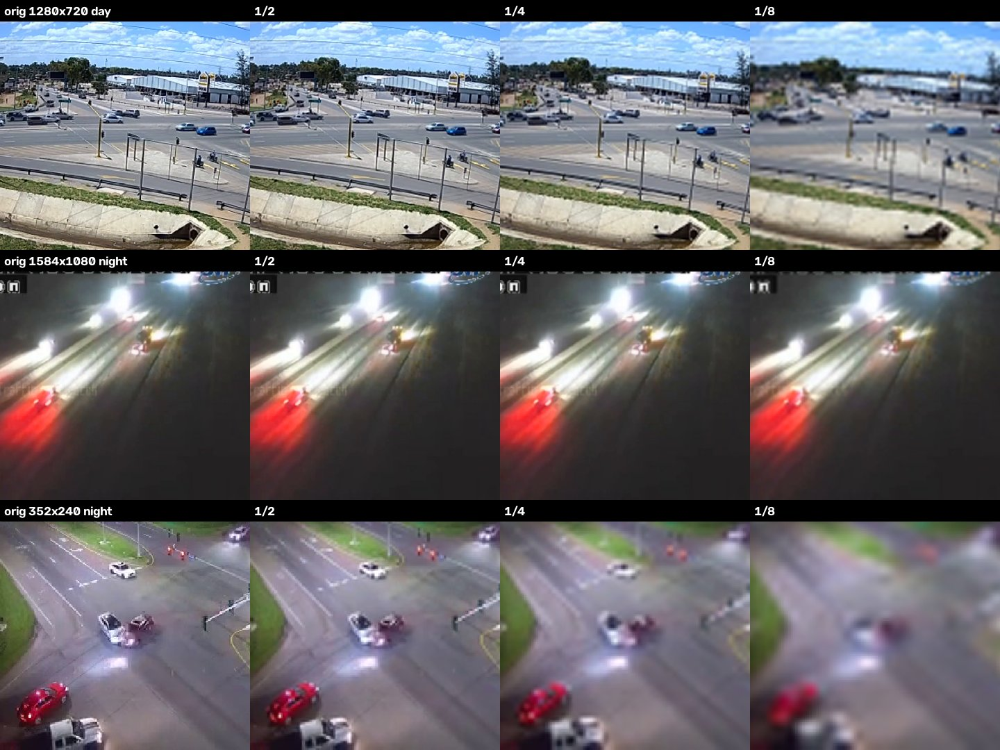
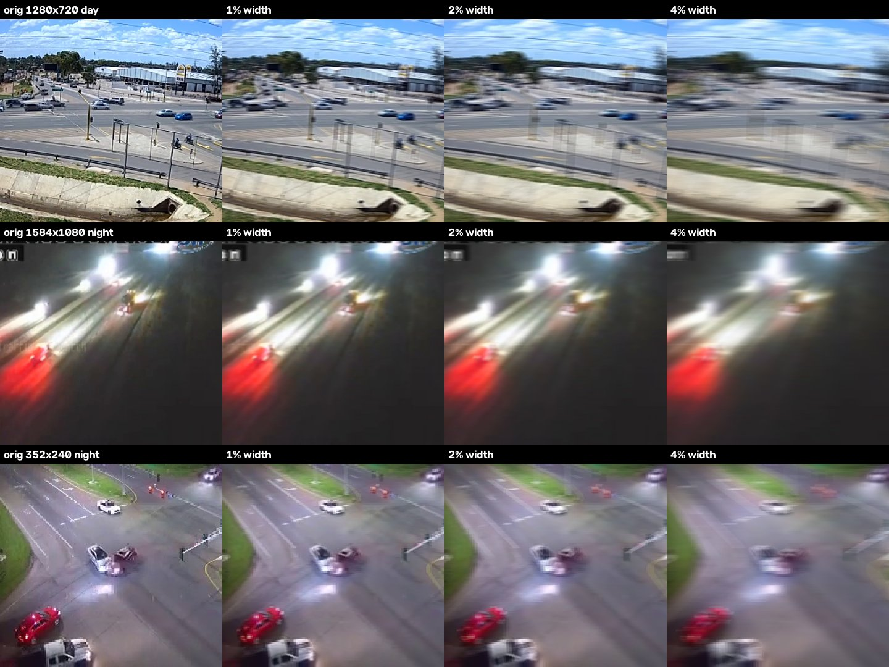

# ACCIDENT test split 데이터 분석 결과

분석일: 2026-09-29. 대상은 공식 IID test split 실제 영상 1,520개다. 원본 영상은 분석 후 삭제했고, 수치는 `data/` 폴더의 CSV에 있다.

- `data/test_split_probe.csv`: 영상별 코덱, 해상도, FPS, 비트레이트 (ffprobe)
- `data/crf_pilot_40.csv`: 샘플 40개를 CRF 23/29/35/41로 재인코딩한 크기 비율

> **출처 및 라이선스**: 이 문서의 샘플 이미지와 CSV는 ACCIDENT 데이터셋(Picek et al., CVPRW 2026, [Kaggle `picekl/accident`](https://www.kaggle.com/datasets/picekl/accident))의 영상과 메타데이터에서 추출·가공한 것이다. 원 데이터와 같은 [CC BY-NC-SA 4.0](https://creativecommons.org/licenses/by-nc-sa/4.0/) 라이선스를 따르며, 비상업적 목적으로만 사용할 수 있다. 가공 내용: 사고 프레임 추출, 충돌 지점 중심 크롭, 해상도·블러·압축 열화 적용.

## 1. 기본 분포

| 항목 | 값 |
|---|---|
| 길이 | 중앙값 29.9초, 99%가 30.1초 이하, 최대 115초 |
| 해상도(짧은 변) | 중앙값 720p. 360p 이하 31개, 360~480p 39개, 480~720p 923개, 720~1080p 498개, 1080p 초과 29개 |
| 해상도 상위 | 1280×720 444개, 960×720 276개, 1920×1080 259개 |
| FPS | 중앙값 15, 범위 3.9~49.7 |
| 주야 | 주간 1,034개, 야간 486개 |
| 날씨 | 맑음 1,191개, 비 236개, 눈 93개 |
| 원본 화질 등급 | Excellent 53개, Good 247개, Fine 412개, Poor 573개, Very Poor 235개 |
| 충돌 유형 | T-bone 506개, Single 500개, Rear-end 240개, Sideswipe 184개, Head-on 90개 |

## 2. 압축 상태

- 1,520개 전부 H.264 High 프로파일, yuv420p다.
- 비트레이트 중앙값은 748kbps(10~90%: 330~1,774kbps)다.
- 픽셀당 비트(bpp)의 중앙값은 0.042이고 화질 등급과 상관없이 거의 같다(0.041~0.051). 원본 화질 등급은 인코딩 설정이 아니라 **촬영 자체의 품질**을 반영한다.
- 샘플 40개를 재인코딩한 결과, **CRF 23이 원본 크기의 96%**를 냈다. 즉 원본이 이미 CRF 23 수준으로 균일하게 인코딩되어 있다.

| 재인코딩 | 원본 대비 크기 (중앙값) | 10~90% 범위 | 크기 변화가 없는 영상 |
|---|---|---|---|
| CRF 29 | 0.51 | 0.47~0.56 | 0/40 |
| CRF 35 | 0.25 | 0.21~0.29 | 0/40 |
| CRF 41 | 0.12 | 0.09~0.16 | 0/40 |

→ CRF 29/35/41은 모든 영상에서 원본 비트레이트의 약 **1/2, 1/4, 1/8**을 만든다. CRF 방식과 비트레이트 비율 방식이 사실상 같은 결과를 낸다.

## 3. 샘플 열화 비교

사고 발생 프레임에서 충돌 지점을 중심으로 잘라 비교했다. 행은 위에서부터 1280×720 주간(Fine), 1584×1080 야간(Very Poor), 352×240 야간(Good)이다.

### 해상도 (원본 대비 1/2, 1/4, 1/8)

### 모션 블러 (프레임 폭 대비 1%, 2%, 4%)

### 압축 (CRF 29, 35, 41)

## 4. 관찰

1. **해상도 1/8은 원본 해상도에 따라 강도 차이가 크다.** 720p 원본은 90p가 되어도 차량 형체가 남지만, 240p 원본은 30p가 되어 충돌 장면을 알아볼 수 없다. 360p 이하 원본은 31개(2%)다.
2. **압축은 눈에 띄는 변화가 가장 작다.** CRF 29와 35는 원본과 거의 구별되지 않고, CRF 41에서 저해상도 영상의 충돌 부위가 뭉개지기 시작한다. 성능 저하도 가장 작게 나올 가능성이 있다.
3. **블러는 1%부터 눈에 띄고 4%에서는 차량 윤곽이 거의 사라진다.** 세 요인 중 단계 간 변화가 가장 뚜렷하다.
4. **원본이 이미 나쁜 영상은 열화를 더 걸어도 변화가 작다(천장 효과).** 야간 Very Poor 영상은 원본부터 헤드라이트 번짐이 심해서, 모든 열화에서 변화가 잘 보이지 않는다. 원본 화질 등급별로 나눠서 분석해야 한다.
